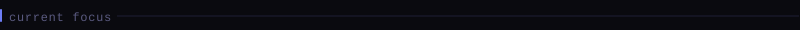
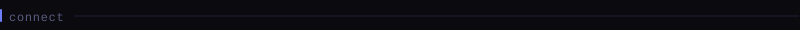

<!--
  Fawadullah15 — GitHub Profile README
  ─────────────────────────────────────
  All graphics are SVG files generated locally by Python scripts
  running inside GitHub Actions. Zero third-party API requests.
  Every pixel under your control.
-->

<!--
  ╔═══════════════════════════════════════════════════════╗
  ║   PORTRAIT + INTRODUCTION                            ║
  ╚═══════════════════════════════════════════════════════╝
  Two-column layout. GitHub keeps align="" and width="" on td/img.
  Styles are stripped, so layout is table-based only.
-->

<table>
<tr>
<td width="460" valign="top" align="left">

</td>
<td valign="middle" align="left">

 

<samp>fawadullah imraj</samp>

  

<blockquote>
BS Artificial Intelligence 
University of Peshawar, Pakistan 
 
Building intelligent systems and clean interfaces. 
AI Engineer in progress. Frontend architect by day.
</blockquote>

 

<samp>
— AI Engineer 
— Frontend Developer 
— FastAPI · React · Python 
— University of Peshawar, Pakistan 
— Open to work · Open to collaborate
</samp>

  

<samp>
currently building 
&nbsp;&nbsp;AI agents · LangChain · LangGraph · MCP
</samp>

</td>
</tr>
</table>

 

---

 

<blockquote>
Full-stack developer with a focus on AI engineering. 
Studying BS Artificial Intelligence at University of Peshawar. 
I build production systems — APIs, frontends, and AI pipelines — 
with the goal of eventually shipping AI SaaS products and 
contributing meaningfully to open source.
</blockquote>

Working at <samp>Monkey Doo</samp> while pursuing my degree. 
Long-term path: AI engineer role in Japan.

 

---

 

<samp>
languages &nbsp;&nbsp;&nbsp;&nbsp;&nbsp; Python · JavaScript · TypeScript 
backend &nbsp;&nbsp;&nbsp;&nbsp;&nbsp;&nbsp; FastAPI · REST · SQLite · Docker 
frontend &nbsp;&nbsp;&nbsp;&nbsp;&nbsp; React · Vite · Tailwind CSS 
ai / ml &nbsp;&nbsp;&nbsp;&nbsp;&nbsp;&nbsp; LangChain · LangGraph · MCP · LLMs 
tooling &nbsp;&nbsp;&nbsp;&nbsp;&nbsp;&nbsp; Git · GitHub Actions · Linux 
learning &nbsp;&nbsp;&nbsp;&nbsp;&nbsp; Machine Learning · AI Agents · open source
</samp>

 

---

 

<samp>
→ &nbsp;building multi-agent AI systems with LangGraph 
→ &nbsp;deepening FastAPI architecture and async patterns 
→ &nbsp;contributing to open source Python and AI tooling
</samp>

 

---

 

 

<samp>view all repositories →</samp>

 

Full project index at <a href="https://github.com/Fawadullah15?tab=repositories">github.com/Fawadullah15</a>

 

---

 

 

 

<table>
<tr>
<td width="395" valign="top">

</td>
<td width="395" valign="top">

</td>
</tr>
</table>

 

---

 

<samp>
all statistics are generated by Python scripts running inside 
GitHub Actions · refreshed daily · zero third-party services
</samp>

 

---

 

<samp>
github &nbsp;&nbsp;&nbsp; github.com/Fawadullah15 
email &nbsp;&nbsp;&nbsp;&nbsp; available on request 
location &nbsp; Pakistan · open to remote
</samp>

 

profile generated by <a href="scripts/">scripts/</a> ·
updated daily by <a href=".github/workflows/refresh.yml">github actions</a> ·
<a href="PORTRAIT_GUIDE.md">add your portrait →</a>

 
